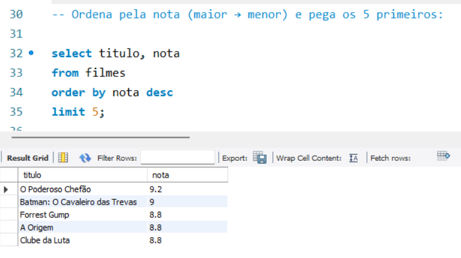
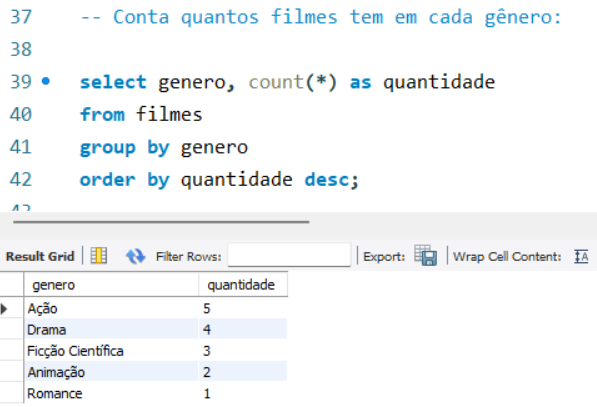
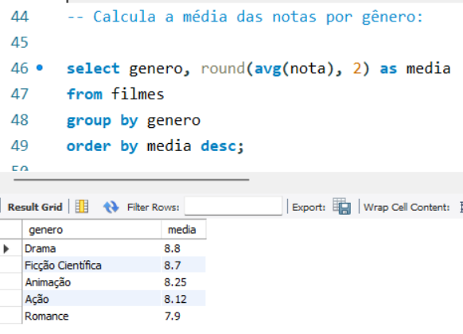

# 🎬 Projeto de Análise de Dados com SQL

## 📊 Sobre o projeto
Este projeto foi desenvolvido com o objetivo de praticar análise de dados utilizando SQL no MySQL Workbench.

## 🧠 Objetivo
Explorar um conjunto de dados de filmes para responder perguntas relevantes através de consultas SQL.

## 🗂️ Estrutura do banco

Tabela: filmes

- titulo
- genero
- ano_lancamento
- nota

## ❓ Perguntas respondidas

1. Quais são os filmes mais bem avaliados?
2. Quantos filmes existem por gênero?
3. Qual a média de nota por gênero?
4. Quais filmes estão acima da média geral?
5. Quantos filmes foram lançados por ano?
6. Quais são os filmes mais recentes?

## 🛠️ Tecnologias utilizadas

- MySQL
- SQL
- MySQL Workbench

  
## 📸 Resultados

### 🔝 Top 5 filmes

### 📊 Média por gênero

### ⭐ Filmes acima da média

## 🚀 Aprendizados

Neste projeto, aprendi a utilizar:
- SELECT
- GROUP BY
- ORDER BY
- AVG()
- COUNT()
- Subqueries
